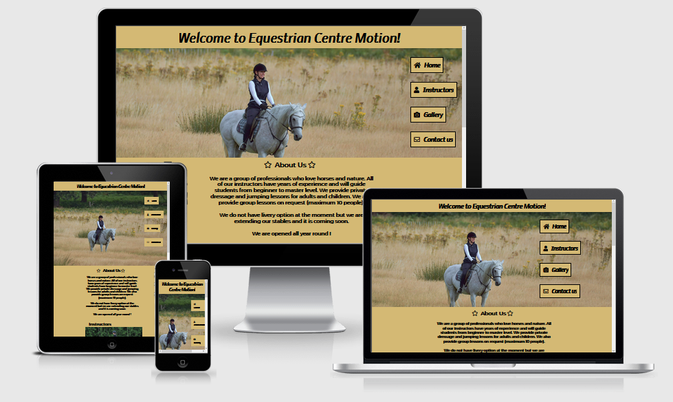
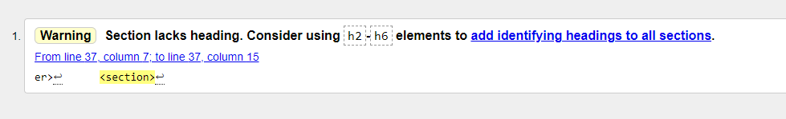

# Equestrian Centre Motion
The Equestrian Centre Motion is a website for equestrian lovers located in Austria. 
Users can find all the information on this Website about the equestrian centre: About the centre, working hours, contact Information and contact us form.

## Features
- Navigation
    - Featured on the top of the page is a user greeting together with the name of the center: Equestrian Centre Motion.
    - Navigation links are to the right: Home, Instructors, Gallery and Contact us which link to the new site which opens on the same page.
    - Greeting and navigation are in colors that complement each other and give contrast and are clear and visible.
    - Navigation is clear and makes all sections easy to find.

- The header
     - Hero image has a good resolution, it does not get pixelated when resized. 
     - User can understand from the image what this page is all about. 

- The About us section
     - The About us section gives a brief description of what this Equestrian Center has to offer to the user.
     - User can then either scroll to see more or click on the contact us to send a question to the center by adding all the details to contact form and submitting it.

- Contact us section
    - Contact us section brings user to a page with a form where user can add all the details and add question or request and send it to the equestrian center.
    - Form is set up with mandatory fields and the user must fill out all the fields to be able to submit the form.

# User Experience

## Goals

### Visitor goals

The target audience for the Equestrian Center Motion Website:

- People based mainly in Austria and EU.
- People who love horses and would love to learn fundamentals of horseback riding.

### User Goals

As a user I would like:

- to be able to book classes online so that I do not have to fill out the contact form.
- to see a map of the area so that I can locate it quicker.
- option to pay for the classes online so that I do not have to pay on arrival.
- to see more Information about instructors and their experience.

## Design Choices

Font choices

I have decided to use [Google Fonts](https://fonts.google.com/). 
 - Two font styles: Nobile for the body and Montserrat for paragraphs and headings.
 - These two font styles complement each other really well.
 - I have included example of the style below:  
    

Icons

- Social Media Icons [Facebook](https://www.facebook.com/), [Instagram](https://www.ginstagram.com/) and [Pinterest](https://www.pinterest.ie/)) are added on the bottom center of the page where user will be able to find further Information about the Equestrian center. Social Media Accounts are not created but show that the user will be able to click on the icons and find further details about the website there in the future.
- [Fontawesome](https://fontawesome.com/) was used to add social media icons.

## Color scheme and styling

I have decided to use 4 colors in the project: 
 - light french beige #BFA674 for the body of the page
 - ecru #D4B974 for the background in the gallery page
 - grullo #AA9374 for the footer
 - black #000000 for text

- Implemented palette consits of  colors: #D4B974 / #AA9374 / #000000

## Wireframes
All wireframes are created with [Balsamiq](https://balsamiq.com/) during the Scope Plane part of the design and planning process for this project.

Landing page with about us section

Instructors page

Gallery

Contact us page

## Testings

### Validator testing and browser compatibility
- I have tested HTML5 code on - [HTML5 validator](https://validator.w3.org/), warnings are left as no heading on section, but no heading required.

- I have tested CSS3 code on  - [Jigsaw validator](https://jigsaw.w3.org/css-validator/#validate_by_uri) and no errors have been found

### Browser compatibility
- I can confirm that I have tested website on four different Web Browsers

Landing page [Google Chrome](https://www.google.com/chrome/?brand=FHFK&gclid=EAIaIQobChMItpXo3cj28gIVNgiICR0PYAlLEAAYASAAEgJ2bPD_BwE&gclsrc=aw.ds)

Instructors page [MS Edge](https://www.microsoft.com/en-us/edge)

Gallery page [Mozzilla Firefox](https://www.mozilla.org/en-US/firefox/new/)

Contact us page [Brave](https://brave.com/)

- Accessibility 
      - I have confirmed that the Website is accessible by inspecting it in Lighthouse on the [Google Chrome](https://www.google.com/) Dev tools.
    
Result for desktop 
 - Performance for the desktop version is great as it is over 90% for each category.

 
Result for mobile devices
- Performance for mobile devices can be improved by placing smaller images and changing the layout.

### Bugs

#### Solved

#### Unsolved bugs
During the regular check up of the Webpage I have noticed favicon.com error. 
When investigating with our Slack community I have tried to fix the issue by adding favicon.ico to my website and adding link href (<link href="./readme/favicon.ico" rel="icon" type="image/x-icon">)to head of html but it did not fix it.
I have also tried to follow reccommendations from [Github](https://github.com/) Community [here](https://github.community/t/i-have-no-idea-what-the-interest-cohort-is/179780/8) but nothing seem to fix this bug.

## Deployment

The site was deployed to Github pages using following steps: 
   - Login to Github and go into repository Ivana505/equestrian-centre-motion
   - Click on settings and scroll down to Pages section on the page
   - Under the source heading select the master branch option and click save
   - The project has now been deployed and wait for approximate 10 minutes for the link to become active
   - Refresh the page and click on the link to view the live site

The live site can be previewed [here](https://ivana505.github.io/equestrian-centre-motion/)

### Local Deployment

In order to make a local copy of this repository, you can type the following into your IDE Terminal:

- `git clone https://github.com/Ivana505/equestrian-centre-motion.git` 

Alternatively, if using Gitpod, you can [click here](https://gitpod.io/#https://github.com/Ivana505/equestrian-centre-motion) to create a new workspace under your account.
  
  # Languages and stechnologies used
- [HTML5](https://en.wikipedia.org/wiki/HTML5)
- [CSS3](https://en.wikipedia.org/wiki/CSS)
- [Github](https://github.com/)
- [Git](https://git-scm.com/)
- [TinyPNG](https://tinypng.com/)
- [FancyBox](https://fancyapps.com/docs/ui/fancybox/)

## Credits

- Image source:
  - [Pexels](https://www.pexels.com/)
      - [Image](https://www.pexels.com/photo/girl-riding-black-horse-1364073/) by Alexander Dummer 
      - 

 [Favicon](https://www.favicon.cc/)
 [coolors](https://coolors.co/)
 [Fontawesome](https://fontawesome.com/)
 [TinyPNG](https://tinypng.com/)
 [Favicon](https://www.favicon.cc/)
 [Favicon](https://www.favicon.cc/)
 [Favicon](https://www.favicon.cc/)
 [Favicon](https://www.favicon.cc/)

### Content
 - Content was created intentionally for the purpose of this project and this Website. Credits go to the creater of the Website.

  